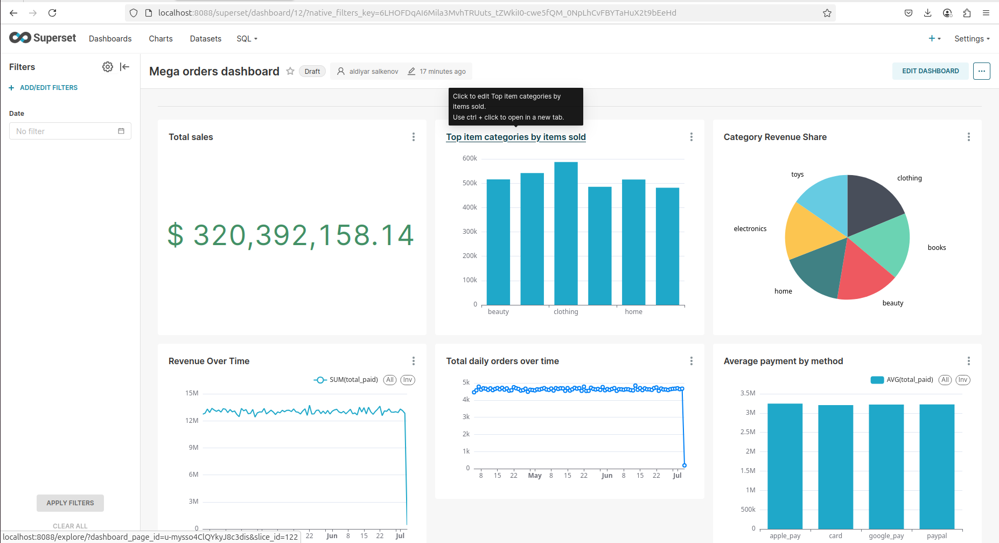

# Pet project

В рамках технического задания необходимо было построить аналитику на основе вложенного JSONL-файла заказов, используя стек: ClickHouse, dbt и Apache Superset.

ClickHouse был развернут в Docker-контейнере.

С помощью Python-скрипта были:

    Распарсены данные из вложенного JSONL-файла.

    Преобразованы вложенные структуры (user, items, payment) в плоские записи.

    Приведены типы данных (например, строки в даты, числа в Float/UInt).

    Загружены данные в таблицу orders.raw_data.

Построена звездная схема (star schema) в dbt:

    Созданы dimension tables: dim_users, dim_items, dim_orders, dim_payments, dim_dates.

    Создана fact table: fct_orders, объединяющая ключевые метрики и внешние ключи.

Построены агрегированные data marts (OBT-модели):

    obt_order_items

    obt_user_daily

    obt_sales_daily

    obt_category_sales

    obt_payments_daily

В Apache Superset:

    Подключена база данных ClickHouse.

    Созданы визуализации по obt_sales_daily и obt_payments_daily (line chart, bar chart, big number).

    Добавлены фильтры.

На выходе получена готовая аналитическая витрина с возможностью:

    Строить дашборды по метрикам заказов, пользователей и платежей.

    Делать срезы по датам, методам оплаты, категориям товаров и т.д.

    Работать с чистыми, нормализованными данными в формате звезды и обобщённых OBT-моделей.
